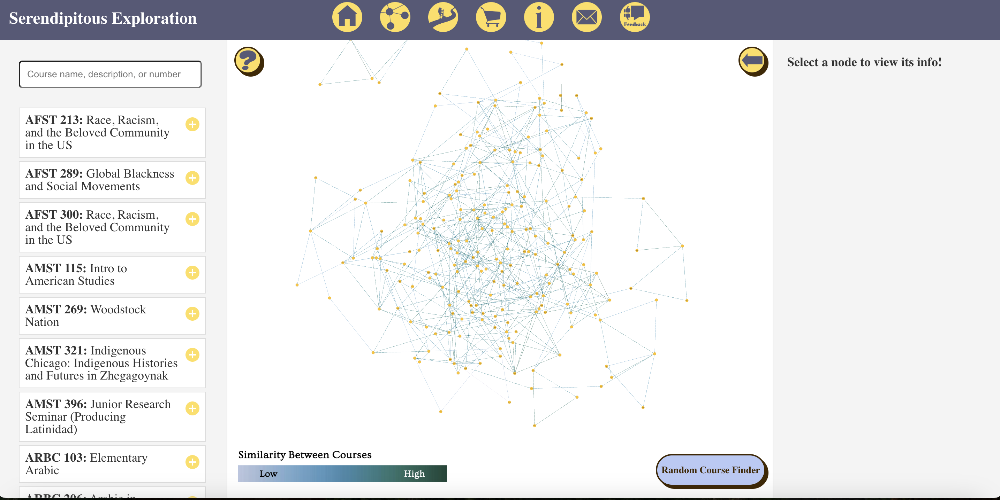

# Serendipitous Exploration of the Carleton Curriculum 
## Carleton Senior Comps Project 2024-2025

Our tool is an interactive forced directed graph that helps students consider more unique classes at Carleton College. 

## Installation: 

1. Clone the repository into the editor you are using (we recommend VS Code\!):

`git clone https://github.com/CharlieNey/Serendipitous-Exploration.git`

2. Ensure that you have Node.js installed. You can check with: `node -v`. Installing node also installs npm, so make sure you have npm as well: `npm -v`.  
   * If you do not have Node.js, go to [nodejs.org](http://nodejs.org) or if you have homebrew, run: `brew install node`  
3. Move into the frontend folder:  
   * To install all dependencies listed in our package.json, run: `npm install`  
   * If you wanted to install things dependency by dependency:   
     1. To install react, run: `npm install react@18.3.1 react-dom@18.3.1`  
     2. To install d3, run: `npm install d3`  
     3. To install necessary calendar dependencies, run: `npm install --save \ @fullcalendar/core \ @fullcalendar/timegrid`  
     4. To install necessary email dependencies, run: `npm install –save @emailjs/browser`

## Database Setup: 

1. Ensure you have postgresql installed.  
   1. If you have homebrew, run: `brew install postgresql`   
   2. Then, run: `brew services start postgresql`  
2. Start postgresql. To do this, run: `psql postgres`  
   1. Create a “courses” database by typing: `CREATE DATABASE courses;`  
   2. Exit postgresql by typing: `quit`   
3. Move into the backend folder.  
4. Run the following two lines to create and populate postgresql tables with data from our CSVs: 

   `psql -U <your_username> -d courses < courseTable.sql`

   `psql -U <your_username> -d courses < graphTable.sql`

## Running the Web-App: 

1. In one terminal, cd into the backend folder and run: `node server.js`  
2. In another terminal, cd into the frontend folder and run: `npm start`  
3. Go to [http://localhost:3000](http://localhost:3000) to see the web-app and check [http://localhost:3001/api/nodes](http://localhost:3001/api/nodes) to see if you are connected to the server.

## How Our Project Works:

### Client

*Technologies used: React.js, D3.js*

We used D3.js to create our web-app’s main feature: a force-directed graph. D3 is a powerful Javascript library that is data-driven and capable of creating complex, interactive graphs. It allowed us to manipulate forces within our graph, adjust other visual elements, and link data to elements.  
React.js, a user-interface library, served as the foundation of our web-app. In addition to creating our web-app layout, React has state management and asynchronous processing that makes it efficient to use. 

### Server 

*Technologies used: Node.js, Express.js, PostgreSQL*

We created a PostgreSQL database to store our generated data. While our dataset is small, we chose PostgreSQL for future scalability. 

Our server side of the project gets data from PostgreSQL using Node.js and Express.js. Node.js allows us to run Javascript on the server and Express.js builds on Node.js and acts as a translator to handle requests between the server and the PostgreSQL database. The server sends fetched data from PostgreSQL to the client side to be visualized.

### Natural Language Processing

*Technologies used: Doc2Vec, Word2Vec, LDA*

We implemented Gensim's [Doc2Vec](https://radimrehurek.com/gensim/auto_examples/tutorials/run_doc2vec_lee.html) (Paragraph Vector) model to capture the semantic meaning of each course description in a multidimensional space. With our courses vectorized, we used cosine similarity to compare them, and find each courses’ similarity to each other.

We combine a [Word2Vec](https://en.wikipedia.org/wiki/Word2vec) model with an [LDA](https://en.wikipedia.org/wiki/Latent_Dirichlet_allocation) topic model to identify the most representative common words between two courses. Specifically, we find the word in one course's description that best aligns with a set of keywords from another course's description. This keyword set includes non-stopword terms and words from the most representative topics in the connected course's description. The identified word serves as the label for the edge connecting the two courses.

### Data

Our data includes 6 credit courses offered in the Spring 2025 term at Carleton College (excluding seminar and capstone courses). It includes only one section for each class, so if you’re curious if a course offers additional sections, please check Carleton’s Course Catalog.

## Features: 

### Graph

The core feature of our project is a force-directed graph in which every node represents a unique course. With our Doc2Vec model, each node in the graph has at least 2 connections to other nodes, with more depending on the quantity of strong connections a course has with other courses.

If there is a line between two courses, it means that their descriptions are similar, according to the model that we used. Our graph is navigable through hovers, clicks, and zooms and is connected to a search bar. 

### Quiz

We implemented a buzz-feed style quiz that asks users questions about their past and preferences and then recommends them a random course from a department which our model finds is similar to departments they are interested in.

### Calendar

We have a calendar feature which allows users to view their saved courses, visualizing their schedule. We also included a feature where users can export their saved courses and email it to themselves.

## Understanding our Directory: 

In the frontend folder, the “src” folder contains our App.js file (which creates the frontend of our web-app), images that we use, and a “components” folder that houses the bulk of our React code. The “components” folder contains each page of our web-app’s javascript and css. 

Our backend folder contains all the elements of our NLP models, the scripts that created them, as well as the data that we ran them on.  Essentially it is split into two important folders, “current models” and “data. The “current models” folder contains all the scripts that set up our models, and the models themselves. Our “data” folder contains our course data, as well as various bits of meta-data and the outputs of our NLP models. In addition, the backend folder has two sql files that create and populate model output data into tables. Our server.js file is also located here, which connects our PostgreSQL database and hosts its tables as accessible urls.

## Contributors: 

Cathy Duan, Willow Gu, Markus Gunadi, Zoey La, Charlie Ney, and Kai Weiner 